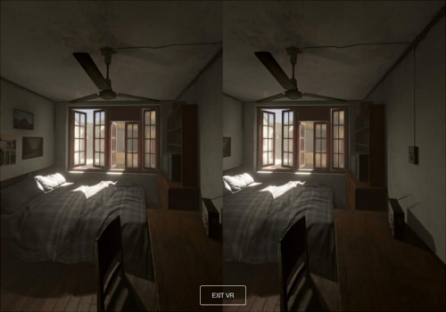
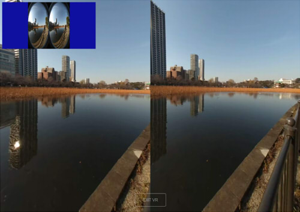

## Panorama180Viewer

パノラマ180-3Dの静止画または動画をWebVRで見る。    
fish Eye動画のShaderを使ったリアルタイム反映など。   

## コードの内容

three.jsのShaderを使用して、    
静止画または動画がEquirectangular180またはFish Eye180のどちらでもVRで見ることができるようにしています。

## 動画のwebm変換について

動画ファイルは、オリジナルのMirage Cameraで撮影した3840 x 2160ピクセルのmp4(H.264)です。    
これを、ffmpegでwebm(VP9)に変換しました。    

変換は以下のようにコマンドラインで行いました。    

    ffmpeg -i 20190224-151603623.vr.mp4 -threads 4 -b:v 0 -crf 40 -vcodec vp9  ueno_park_20190224.webm

「20190224-151603623.vr.mp4」がオリジナルの動画ファイル。    
「-threads 4」で変換で使用するスレッド数を指定。    
「-b:v 0 -crf 40」で品質指定。    
「-b:v 0」の指定は必須。    
「-crf」は0-63で0に近づくほど品質が上がる。   
ただし、品質を上げると計算時間がかかり、ファイルサイズは大きくなる。    
「-vcodec vp9」でVP9のコーデック指定。    

上記変換で「20190224-151603623.vr.mp4」が37.9MBだったのが、「ueno_park_20190224.webm」で2.99MBになった。    

## [show_webvr180_sbs.html](./show_webvr180_sbs.html)

パノラマ180-3D(Side By Side)の静止画をWebVRでプレビューします。    

    

以下は、実行デモです。    

https://ft-lab.jp/WebGL/WebGLTest/Panorama180Viewer/show_webvr180_sbs.html

URLの引数として、以下のように指定できます。    

    image=xxx.jpg&intensity=1.2&projectionmode=1

imageで参照する画像ファイル、intensityで明るさ、    
projectionmode＝１でEquirectangularのSide By Side、projectionmode＝2でFish EyeのSide By Sideです。    

## [show_webvr180_sbs_video.html](./show_webvr180_sbs_video.html)

パノラマ180-3D(Side By Side)の動画をWebVRでプレビューします。    
このパノラマ動画は、Mirage Cameraで撮影したFish Eyeをwemb(VP9)に変換したものになります。    

    

WebVR前の画面にて、左上に動画のサムネイルを表示してます。    
PC版のFirefoxでは、このwebmでのサムネイルのアスペクト比が正しくないようです。     
Oculus GoのFirefox Realityの場合は、左上のサムネイルが表示されないようです。    
また、Oculus GoのOculus Browser(標準ブラウザ)、Firefox Realityだと再生が重い感じです。    
後で調査予定。     

以下は、実行デモです。    

https://ft-lab.jp/WebGL/WebGLTest/Panorama180Viewer/show_webvr180_sbs_video.html

URLの引数として、以下のように指定できます。    

    image=xxx.mp4&intensity=1.2&projectionmode=1

imageで参照する動画ファイル、intensityで明るさ、    
projectionmode＝１でequirectangularのSide By Side、projectionmode＝2でFish EyeのSide By Sideです。    

----
