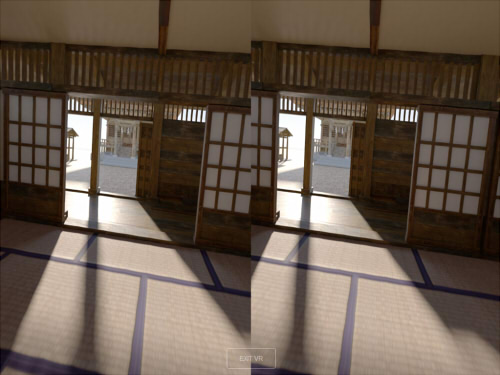
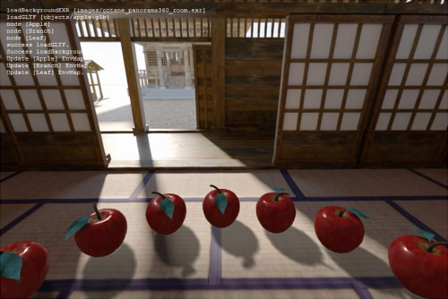
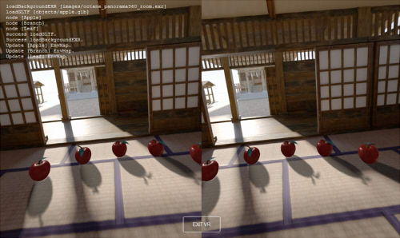
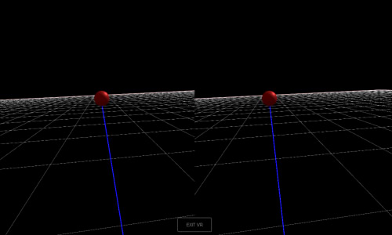
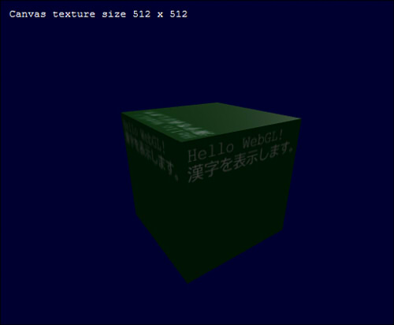
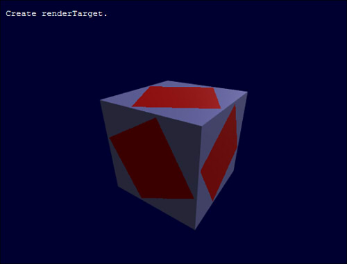
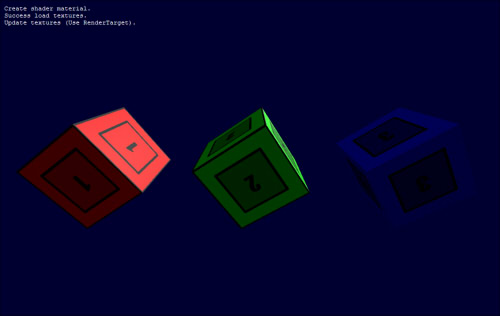
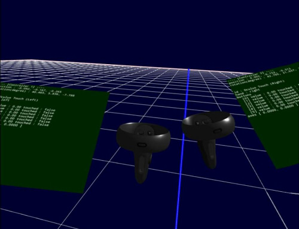

## SimpleExamples

WebGL/WebVRの簡単なサンプルです。    
PC上のfirefox上、Oculus QuestのBrowser上で動作確認済みのものになります。    

## 開発環境

three.js r104    

## ソース説明

three.jsのJavaScriptの指定は、「../threejs」内に配置しています。    
three.jsのファイルは、このGitHubのリポジトリには内包していません。    
環境に合わせて書き換えるようにしてくださいませ。    

    
    
    		

## 内容
----
### [show_panorama360.html](./show_panorama360.html)    

パノラマ360-3Dの静止画をWebVRで見る。    
     
パノラマ画像は、Unity上のOctaneでレンダリング。    

以下は、実行デモです。    
[https://ft-lab.jp/WebGL/WebGLTest/SimpleExamples/show_panorama360.html](https://ft-lab.jp/WebGL/WebGLTest/SimpleExamples/show_panorama360.html)    

----

### [show_gltf.html](./show_gltf.html)    

これは、WebGLのサンプルになります(WebVRではありません)。    

glTFの読み込み。    
exrファイルをEquirectangularで読み込んで、CubeMapに変換してEnvMapとして割り当て。    
背景のjpegファイルをEquirectangularで読み込んで、背景球に割り当て。    
地面に影のみを落とす。    
THREE.OrbitControlsを使用してのマウスドラッグでのカメラ操作（視点固定、回転のみ）。    
ログの表示。    
テクスチャや形状の読み込みは、非同期で行っています。     
     
パノラマ画像は、Unity上のOctaneでレンダリング。    

以下は、実行デモです。    
[https://ft-lab.jp/WebGL/WebGLTest/SimpleExamples/show_gltf.html](https://ft-lab.jp/WebGL/WebGLTest/SimpleExamples/show_gltf.html)    

----

### [show_gltf_vr.html](./show_gltf_vr.html)    

上記の「show_gltf.html」をWebVR対応にしたものです。    

glTFの読み込み。    
exrファイルをEquirectangularで読み込んで、CubeMapに変換してEnvMapとして割り当て。    
背景のjpegファイルをEquirectangular360-3Dで読み込んで、背景球にステレオで割り当て。    
地面に影のみを落とす。    
ログの表示。    
テクスチャや形状の読み込みは、非同期で行っています。     
VR実行時にカメラを固定(3DoF)。    
     
パノラマ画像は、Unity上のOctaneでレンダリング。    

以下は、実行デモです。    
[https://ft-lab.jp/WebGL/WebGLTest/SimpleExamples/show_gltf_vr.html](https://ft-lab.jp/WebGL/WebGLTest/SimpleExamples/show_gltf_vr.html)    

----

### [grid_scene_vr.html](./grid_scene_vr.html)    

WebVRの移動(6DoF)確認用。    
地面にグリッドを描画（グリッドは1m間隔）。    
     

以下は、実行デモです。    
[https://ft-lab.jp/WebGL/WebGLTest/SimpleExamples/grid_scene_vr.html](https://ft-lab.jp/WebGL/WebGLTest/SimpleExamples/grid_scene_vr.html)    

----

### [draw_text.html](./draw_text.html)    

これは、WebGLのサンプルになります(WebVRではありません)。    

Canvasへの描画を使用し、テキストをテクスチャにして描画します。    
     

以下は、実行デモです。    
[https://ft-lab.jp/WebGL/WebGLTest/SimpleExamples/draw_text.html](https://ft-lab.jp/WebGL/WebGLTest/SimpleExamples/draw_text.html)    

----

### [render_target.html](./render_target.html)    

これは、WebGLのサンプルになります(WebVRではありません)。    

THREE.WebGLRenderTargetを使用し、いったんテクスチャ(RenderTarget)にシーンを描画した後、    
メインシーンのテクスチャとして使用します。    
     

以下は、実行デモです。    
[https://ft-lab.jp/WebGL/WebGLTest/SimpleExamples/render_target.html](https://ft-lab.jp/WebGL/WebGLTest/SimpleExamples/render_target.html)    

----

### [preRender_textures.html](./preRender_textures.html)    

これは、WebGLのサンプルになります(WebVRではありません)。    

THREE.WebGLRenderTargetを使用し、いったん作業用テクスチャ(RenderTarget)にShaderを使用した描画を行った後、    
読み込んだテクスチャをTHREE.WebGLRenderer.copyFramebufferToTextureを使って置き換えます。    
     

以下は、実行デモです。    
[https://ft-lab.jp/WebGL/WebGLTest/SimpleExamples/preRender_textures.html](https://ft-lab.jp/WebGL/WebGLTest/SimpleExamples/preRender_textures.html)    

----

### [vr_controller.html](./vr_controller.html)    

navigator.getGamepadsを使用し、Oculus Questのハンドコントローラのボタン情報を取得します。    
3DモデルはShade3Dで作成( [OculusQuest_HandController.shd](./objects/OculusQuest_HandController.shd) )し、glTF( [OculusQuest_HandController.glb](./objects/OculusQuest_HandController.glb) )で出力したものです。    

     

以下は、実行デモです。    
[https://ft-lab.jp/WebGL/WebGLTest/SimpleExamples/vr_controller.html](https://ft-lab.jp/WebGL/WebGLTest/SimpleExamples/vr_controller.html)    

----
